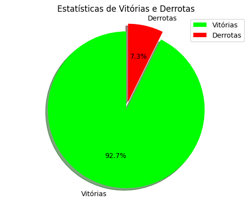

# Jogo da Forca

## Participante(s):
* [Lucca Hiratsuca Costa](https://github.com/LuccaHiratsuca)

## Descrição do Projeto

Esse projeto tem como finalidade o desenvolvimento e implementação de um jogador de jogo da forca, além da avaliação de seu desempenho em diferentes cenários.

## Pré-requisitos e dependências

Clonar o repositorio do projeto:

```bash
https://github.com/LuccaHiratsuca/jogo-da-forca.git
```

Instalar as dependencias:

```bash
pip install -r requirements.txt
```

## Como rodar a aplicação

Para rodar a aplicação, basta executar o arquivo `main.py`:

```bash
python main.py
```

## Implementação


## Exemplos de falha


## Resultado dos testes




